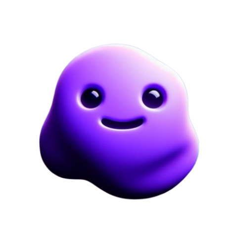

# 🤖 OllamaMulti-RAG: Neura-Nix
> **AI-powered assistant that understands Text, Images, PDFs, and Audio — built for productivity, business, and beyond.**  

<!---->

## 🌟 Introduction
**Neura-Nix** is a next-gen **multimodal assistant** that combines the power of **Ollama, OpenAI, Whisper, and Redis** into a single streamlined platform.  
It enables natural and intelligent interaction across different mediums — **chat with documents, analyze images, transcribe audio, and converse in real-time**.  

Built with **Streamlit**, **Docker**, and **Redis caching**, Neura-Nix is designed for **speed, extensibility, and scalability**.  
Whether you’re an **enterprise optimizing workflows** or an **individual boosting productivity**, Neura-Nix adapts seamlessly.  

[![Info](https://img.shields.io/badge/Project-Info-blue?style=flat&logo=data:image/svg%2bxml;base64,PD94bWwgdmVyc2lvbj0iMS4wIiBlbmNvZGluZz0iaXNvLTg4NTktMSI/Pg0KPCEtLSBHZW5lcmF0b3I6IEFkb2JlIElsbHVzdHJhdG9yIDE5LjAuMCwgU1ZHIEV4cG9ydCBQbHVnLUluIC4gU1ZHIFZlcnNpb246IDYuMDAgQnVpbGQgMCkgIC0tPg0KPHN2ZyB2ZXJzaW9uPSIxLjEiIGlkPSJDYXBhXzEiIHhtbG5zPSJodHRwOi8vd3d3LnczLm9yZy8yMDAwL3N2ZyIgeG1sbnM6eGxpbms9Imh0dHA6Ly93d3cudzMub3JnLzE5OTkveGxpbmsiIHg9IjBweCIgeT0iMHB4Ig0KCSB2aWV3Qm94PSIwIDAgNTEyIDUxMiIgc3R5bGU9ImVuYWJsZS1iYWNrZ3JvdW5kOm5ldyAwIDAgNTEyIDUxMjsiIHhtbDpzcGFjZT0icHJlc2VydmUiPg0KPHBhdGggc3R5bGU9ImZpbGw6IzBBNEVBRjsiIGQ9Ik0yNTYsNTEyYy02OC4zOCwwLTEzMi42NjctMjYuNjI5LTE4MS4wMi03NC45OEMyNi42MjksMzg4LjY2NywwLDMyNC4zOCwwLDI1Ng0KCVMyNi42MjksMTIzLjMzMyw3NC45OCw3NC45OEMxMjMuMzMzLDI2LjYyOSwxODcuNjIsMCwyNTYsMHMxMzIuNjY3LDI2LjYyOSwxODEuMDIsNzQuOThDNDg1LjM3MSwxMjMuMzMzLDUxMiwxODcuNjIsNTEyLDI1Ng0KCXMtMjYuNjI5LDEzMi42NjctNzQuOTgsMTgxLjAyQzM4OC42NjcsNDg1LjM3MSwzMjQuMzgsNTEyLDI1Niw1MTJ6Ii8+DQo8cGF0aCBzdHlsZT0iZmlsbDojMDYzRThCOyIgZD0iTTQzNy4wMiw3NC45OEMzODguNjY3LDI2LjYyOSwzMjQuMzgsMCwyNTYsMHY1MTJjNjguMzgsMCwxMzIuNjY3LTI2LjYyOSwxODEuMDItNzQuOTgNCglDNDg1LjM3MSwzODguNjY3LDUxMiwzMjQuMzgsNTEyLDI1NlM0ODUuMzcxLDEyMy4zMzMsNDM3LjAyLDc0Ljk4eiIvPg0KPHBhdGggc3R5bGU9ImZpbGw6I0ZGRkZGRjsiIGQ9Ik0yNTYsMTg1Yy0zMC4zMjcsMC01NS0yNC42NzMtNTUtNTVzMjQuNjczLTU1LDU1LTU1czU1LDI0LjY3Myw1NSw1NVMyODYuMzI3LDE4NSwyNTYsMTg1eiBNMzAxLDM5NQ0KCVYyMTVIMTkxdjMwaDMwdjE1MGgtMzB2MzBoMTQwdi0zMEgzMDF6Ii8+DQo8Zz4NCgk8cGF0aCBzdHlsZT0iZmlsbDojQ0NFRkZGOyIgZD0iTTI1NiwxODVjMzAuMzI3LDAsNTUtMjQuNjczLDU1LTU1cy0yNC42NzMtNTUtNTUtNTVWMTg1eiIvPg0KCTxwb2x5Z29uIHN0eWxlPSJmaWxsOiNDQ0VGRkY7IiBwb2ludHM9IjMwMSwzOTUgMzAxLDIxNSAyNTYsMjE1IDI1Niw0MjUgMzMxLDQyNSAzMzEsMzk1IAkiLz4NCjwvZz4NCjxnPg0KPC9nPg0KPGc+DQo8L2c+DQo8Zz4NCjwvZz4NCjxnPg0KPC9nPg0KPGc+DQo8L2c+DQo8Zz4NCjwvZz4NCjxnPg0KPC9nPg0KPGc+DQo8L2c+DQo8Zz4NCjwvZz4NCjxnPg0KPC9nPg0KPGc+DQo8L2c+DQo8Zz4NCjwvZz4NCjxnPg0KPC9nPg0KPGc+DQo8L2c+DQo8Zz4NCjwvZz4NCjwvc3ZnPg0K)](https://github.com/UjjwalSaini07/OllamaMulti-RAG/blob/main/README.md)

## 🚀 Key Features
- **📖 Document Chat (PDF RAG)** → Upload PDFs and extract context-aware insights.  
- **🖼️ Image Analysis** → Unlock hidden stories from visual data.  
- **🎤 Audio to Text** → Record or upload audio and let Whisper transcribe in seconds.  
- **💬 Persistent Chat Sessions** → Store, manage, and reload previous conversations.  
- **⚡ Redis Caching** → Lightning-fast performance with session-level caching.  
- **🎯 Model Flexibility** → Switch easily between **Ollama** and **OpenAI models**.  
- **🔐 Secure by Design** → Environment variables, `.env.sample`, and Dockerized deployment.  
- **📊 Optimized Vector Storage** → ChromaDB-backed semantic search for documents.  
- **🎨 Modern UI** → Built with Streamlit, responsive and minimal.

## 📽️ Demo
Coming soon... 🎬  
> [!IMPORTANT]  
> Use the Docker image or run the project locally via `localhost` to get started.
Before proceeding, please contact me at [Mail](mailto:ujjwalsaini0007+ollama@gmail.com)
so I can share the credentials instead Docker extract your whole memory.

## 🛠️ Technology Stack
- **Frontend/UI** → [Streamlit](https://streamlit.io/)  
- **LLMs & Embeddings** → [Ollama](https://ollama.com/) + [OpenAI](https://platform.openai.com/)  
- **Audio Transcription** → [Whisper](https://openai.com/research/whisper)  
- **Vector Database** → [ChromaDB](https://www.trychroma.com/)  
- **Caching & Session Store** → [Redis Cloud](https://redis.io/)  
- **Containerization** → [Docker](https://www.docker.com/) + Docker Compose  
- **Web Server** → [NGINX](https://nginx.org/) (reverse proxy & static serving)  
- **Database** → SQLite (lightweight local DB for session caching)  
- **Orchestration** → GitHub Actions + Dependabot for CI/CD  

